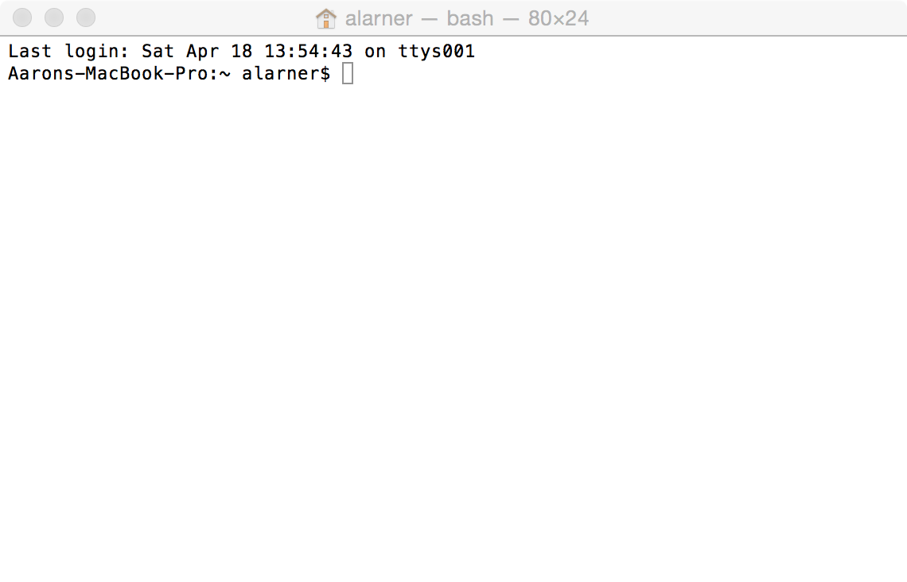
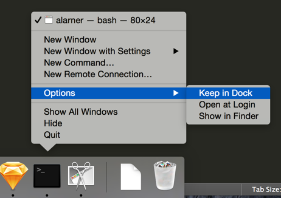

# Command Line

### You should already know about
* [Trees](../trees/README.md)
* [Paths](../paths/README.md)

The command line allows you to interact with your computer in a flexible and powerful way. It's one of the tools of choice for web developers and programmers in general. Below we're going to cover a few of the most common commands that you run on the command line, and we'll make good use of the tree data structure and paths that you've already learned about.

On out Macs, we interact with the command line via an application called the **Terminal**. The Terminal application comed pre-installed on your mac. To access the terminal type `command (⌘)` + `space` and type in `terminal` then press enter.

I like to use an application called **iTerm 2** instead of Terminal because it adds some nice features in addition to everything that the Terminal offers. You're welcome to use either one. To get iTerm 2, follow [this link](http://iterm2.com/) and download it.

After opening up the Terminal you should see a screen like this:

At this point I'd recommend right clicking on the Terminal icon in your dock and selecting `Options` > `Keep in Dock` because you will be using it very often.

While in the terminal app we can only type. There is no graphical interface. We do everything we need to do by typing. When you get good at this it can be very quick. Each command is executed as soon as you press enter.

### Commands

##### pwd
While we are on the command line, we are always located inside of a directory on our computer. To see the diectory where we are currently located we use the `pwd` command. Type `pwd` and press enter. It should show you the root relative path where you are currently located. `pwd` stands for **p**rint **w**orkgin **d**irectory.

##### ls
To see all the children inside of the current directory we use the `ls` command (short for list). When you type `ls` and press enter you should see a list of all of the *visible* files and folders inside of the current directory. To see more information as well as hidden files and folders you can use the `ls -al` command. The `-al` part of the command specifies some options for the command. Many commands have additional options. Specifically the `a` part of the options tells the command to show hidden files and folders (ones that start with a `.`). The `l` part of the options tells the command to show the "long" format including file size and other useful information.

##### cd
What if we want to change our current directory? That's what the `cd` command is for. To change to a new directory we type `cd` followed by the root relative or document relative path where we want to go. For example, `cd /Users/alarner` will take me to my home directory nomatter what my current directory is. If I'm currently in the `/Users/alarner` directory I can type `cd ..` to move up the directory tree to the `Users` directory.

##### touch
The `touch` command allows you to create a new, empty file via the command line. For example, `touch hello.txt` will create a new `hello.txt` file in the current directory. You can also use a root relative or document relative path to specify where the file should be created. For example, `touch /Users/alarner/foo.txt` will create an empty `foo.txt` file in my home directory.

##### mkdir
If we want to create a new directory we use the `mkdir` (for make directory) command followed by a root relative or document relative path. For example `mkdir test` will create a new `test` directory as a child of the current directory. `mkdir /Users/alarner/bin/test` will create a new test directory as a child of the `bin` directory. If the `bin` directory doesn't exist then the command will throw an error. We can use the `-p` option to tell `mkdir` to create a directory even if it's parent directory doesn't yet exist. For example, `mkdir -p /Users/alarner/bin/test` will create the `bin` directory if it doesn't already exist, and put the `test` directory inside it.

##### rm
To delete a file we use the `rm` (for remove) command followed by the root relative or document relative path to the file we want to delete. For example, `rm hello.txt.` will remove the `hello.txt` file within the current directory. By default, `rm` will not delete a directory. To remove an entire directory we must use the `-r` (for recursive) option. Using the `-r` option will remove the directory and anything in it. For each file or subdirectory it will ask you if you want to delete it. That can be cumbersome if you're trying to delete a directory with hundreds or thousands of files. To prevent the command for asking to to verify deleting each file you can use the `-f` (for force) option. For example, `rm -rf test` will delete the test directory inside of the current directory, and everything that's inside of the test directory. **USING `rm -rf` CAN BE VERY DANGEROUS**. Tripple check that you actually want to run the command before you press enter because there is no way to recover deleted files.

##### nano
The `nano` command will open up a simple command line based text editor. There are several other command line based text editors like `vim` and `emacs`, but `nano` is the simplest. It's great for making simple changes to text files from the command line.

##### open
The `open` command will open up a file in whatever its default application is. For example, `open hello.txt` will open the `hello.txt` file in whatever you have set as your default editor for text files.

### Tips and Tricks

##### tab completion
Using the command line involves typing lots of root relative and document relative paths. This can often be tedious and prone to errors. The command line is not forgiving, so if you mistype one character in your path, the command you are trying to run is going to fail, or do something that you don't expect. To help alleviate these problems, we use **tab completion**. Both the Terminal and iTerm 2 allow you to press your `tab` key while in the middle of typing out a path. If there is only one path that could possibly fit what you are typing in, then the Terminal will automatically fill in that entire path. If there are multiple paths that could fit what you are typing in, you can quickly press `tab` twice, and it will list out all of your options.

##### man pages
If you're curious about all of the options available for a certain command, you can type `man` followed by the name of the command that you want to learn more about. This will display all of the options available to that command, as well as other useful information. For example, `man ls` will show you all of the options available when using the `ls` command.